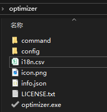
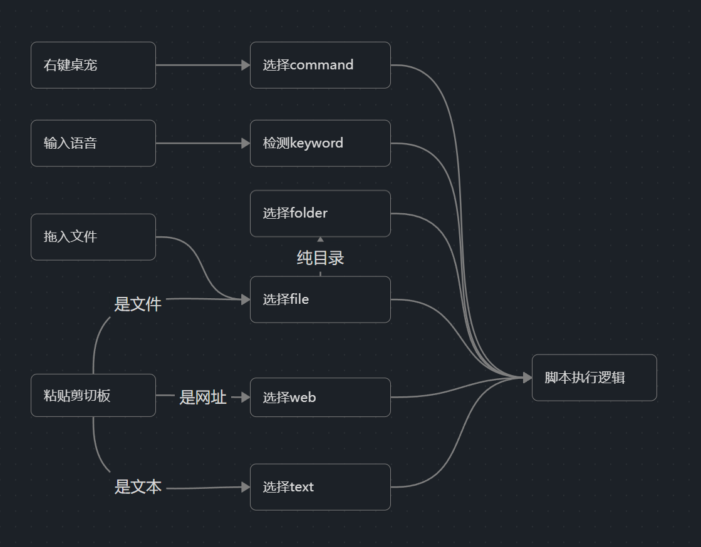

## 一、 目录结构规范

模组根目录应以功能命名（以：`optimizer` 为例）。系统在加载模组时会检索以下四类文件/目录：



### 1. 3i 配置文件

包含图标、模组数据及多语言支持。

* `icon.png/jpg`: 模组缩略图。
* `info.json`: 模组配置数据。
* `i18n.csv`: 多语言本地化数据。

### 2. 脚本目录

根据交互功能存放对应的逻辑脚本，文件夹名称必须严格对应：

* `command` | `keyword` | `folder` | `file` | `web` | `text`

### 3. 配置目录

* `config/`: 存储模组配置信息。
* `anim/`: 存储桌宠动画文件。
* `dialogue/`: 存储桌宠对话文本。

### 4. 节点脚本 (Node)

* `node/`: 存放直接挂载进游戏的 Node 脚本。
* （**注意：目前为测试功能，可以忽略**）。

---

## 二、 3i 配置信息

### 1. 模组缩略图 (`icon.png`)

* **规格要求**：建议比例为 **1:1**（避免 Steam 产生黑边）。
* **文件大小**：请务必压缩至 **1MB 以内**，否则可能导致上传失败。

### 2. 模组信息 (`info.json`)

定义模组在创意工坊及本地管理器的展示信息。**官方标签可查看同目录下的 tags 文件**。

```json
{
  "itemid": 3659725101, //创意工坊id,新建时无需填写,会自动回填
  "visibility": 0, //可见性 0公开 1好友 2隐藏
  "title": "optimizer - 系统优化", //模组标题(仅新建时生效)
  "description": "工具栏添加经典系统优化工具optimizer", //模组描述(仅新建时生效)
  "changenote": "初始版本发布", //更新日志
  "tags": ["System"] //标签
}
```

### 3. 本地化数据 (`i18n.csv`)

实现多语言支持的核心文件。请确保第一行为语言标识符，第一列为翻译 ID，其他为对应的翻译文本。使用 **UTF-8** 编码格式。**如果不想做本地化，这个可以跳过，到时候直接填写即可**。

| ID        | zh_CN | zh_TW | en               | ja      | ko      | de                 | fr                 | es                      | it                     | pt                    | ru                  | vi                  | th                      |
| --------- | ----- | ----- | ---------------- | ------- | ------- | ------------------ | ------------------ | ----------------------- | ---------------------- | --------------------- | ------------------- | ------------------- | ----------------------- |
| optimizer | 系统优化  | 系統優化  | System Optimizer | システム最適化 | 시스템 최적화 | System-Optimierung | Optimiseur système | Optimizador del sistema | Ottimizzazione sistema | Otimizador de sistema | Оптимизация системы | Tối ưu hóa hệ thống | ตัวเพิ่มประสิทธิภาพระบบ |

---

## 三、 交互逻辑与脚本执行



如图桌宠有 4 种交互方式、6 种脚本类型并最后使用一套脚本执行逻辑。

### 1. 交互方式 (Triggers)

目前支持以下 **4 种** 触发路径：

* **右键菜单**：用户通过右键点击桌宠弹出的功能列表进行触发。
* **语音指令**：通过语音识别关键词触发。
* **拖入文件**：将文件、目录、快捷方式丢给桌宠触发。
* **粘贴剪切板**：复制信息后，点击桌宠，黏贴触发。

### 2. 脚本类型 (Script Types)

脚本必须放置在对应的文件夹内，游戏会根据文件夹名称识别其功能类型：

| **文件夹名**    | **功能说明**             |
| ----------- | -------------------- |
| **command** | 右键后点击执行的脚本           |
| **text**    | 黏贴文本后执行的脚步           |
| **folder**  | 拖入纯目录后执行的脚本          |
| **file**    | 拖入文件后，根据后缀名执行的脚本     |
| **web**     | 黏贴网址后根据网站 host 执行的脚本 |
| **keyword** | 关键词触发后执行的脚步          |

### 3. 脚本信息怎么填

1. 首先在脚本类型目录下再创建若干子目录，每个目录对应一个脚本功能，目录名建议简述该脚本的作用。
2. 在该子目录下，同样创建一个 `info.json` 用于描述脚本信息。其可填的参数如下。

#### 通用脚本信息

| 字段名     | 类型           | 作用                                                                                                                                                                                |
| ------- | ------------ | --------------------------------------------------------------------------------------------------------------------------------------------------------------------------------- |
| id      | string       | 脚本的唯一 id，越长，越独特比较好。**默认为脚本目录名**                                                                                                                                                   |
| excute  | bool         | 默认为 **true**，是否有脚本要执行，这要求你在目录下，提供一个 **execute.gd** 文件，并在里面实现一个继承于 **RefCounted**，并有 **func execute(info: Dictionary) -> void** 的类供游戏调用。                                           |
| tool    | string       | 填写脚本需要用到的工具，其信息会在脚本执行时从 info 的 tool 这个 key 中传入                                                                                                                                    |
| tools   | list(string) | 有时候需要的工具不止一个，就需要填写这个字段，其信息会在脚本执行时从 info 的 tools 这个 key 中传入                                                                                                                        |
| showOut | bool         | 默认为 **false**，是否需要显示完成路径，若为 ture，则会在完成之后出现打开目录的选项，后续还可在此添加其他选项。                                                                                                                   |
| tip     | string       | 完成提示，默认为 **完成啦**。                                                                                                                                                                 |
| wait    | bool         | 默认为 **false**，是否需要等待，如果我脚本执行的时间较长，需要有“稍等哦”的提示，将其设为 **true**                                                                                                                       |
| cheer   | bool         | 默认为 **true**，执行完成之后是否会有庆祝动作                                                                                                                                                       |
| option  | bool         | 默认为 **false**，是否有多级选择,如打开网页你需要让用户选择打开哪个网页，这要求你在目录下提供一个 **option.dialogue** 供 dialogue manager 读取。格式请查询 dialogue manager，暂且不做详细描述。                                                 |
| prepare | bool         | 默认为 **false**，在 **option 为 true** 时才生效，这要求你在目录下，提供一个 **prepare.gd** 文件，并在里面实现一个继承于 **RefCounted**，并有 **func prepare(info: Dictionary) -> void** 的类供游戏在进入选择前调用，**以预处理信息，来提供不同的选择** |

#### 可见脚本信息

3. 上方为通用脚本信息，除了 **keyword**，其他为 **可见脚本**，有如下信息需要填写：

| 字段名    | 类型     | 作用                                                                        |
| ------ | ------ | ------------------------------------------------------------------------- |
| name   | string | 脚本显示名称                                                                    |
| group  | string | 所属的脚本组 id，如 command 中的工具就是一个脚本组，以此构建脚本层面的多级选择。对于其他的脚本类型，打算有空再实现，**可以不填**。 |
| icon   | string | 默认为 **icon.png**，指向脚本目录下 **脚本图标的相对路径**，推荐提供 32x32 的图标，不填也没事，只是不显示图标罢了。    |
| config | string | **临时功能后续可能会重构**，填写脚本目录下 **脚本配置文件的相对路径**，其会在 **配置栏** 中，**自动注册该脚本的配置项**     |

#### 特定脚本额外项

4. **folder** 在可见脚本的基础上，有额外一项可填：

| 字段名   | 类型   | 作用                       |
| ----- | ---- | ------------------------ |
| multi | bool | 默认为 **false**，是否支持多个目录输出 |

5. **web 和 file** 在可见脚本的基础上，有额外三项可填：

| 字段名        | 类型           | 作用                                        |
| ---------- | ------------ | ----------------------------------------- |
| batch      | bool         | 默认为 **false**，是否支持文件/网址输入                 |
| multi      | bool         | 默认为 **false**, 输入的多个文件/网址是否支持是不同的后缀名/host |
| extensions | list(string) | 支持的后缀名/host,如果不填则表示所有文件/网址都支持             |

6. **keyword** 在通用脚本的基础上，有一个 **keywordList** 需要填写，其是一个 **列表**，列表的每个元素有下方信息需要填写：

| 字段名      | 类型                         | 作用                                                                                  |
| -------- | -------------------------- | ----------------------------------------------------------------------------------- |
| keywords | list (string)              | 激活用的关键词,其格式是【tokens 列表】@【关键词 id】，推荐下载对应模型的 tokens。**中英文模型的 tokens 见同目录下 tokens 文件** |
| info     | dictionary (string,string) | 激活关键词附带的信息,会随着 info 一起传入脚本                                                          |

---

## 四、 脚本怎么写

脚本格式上文已经介绍的很清楚了,现在核心要描述的是 **信息如何传递** 以及 **api 的使用**。

### info 包含的信息

最核心的传递方式是通过 **传入的 info 字典**，将需要的信息从 info 中取出，再把需要传出的信息放入 info 中。info 中传入的信息如下：

| 字段名    | 类型           | 作用                                                                                                |
| ------ | ------------ | ------------------------------------------------------------------------------------------------- |
| script | string       | 脚本目录的绝对路径                                                                                         |
| mod    | string       | 模组目录的绝对路径                                                                                         |
| out    | string       | 输出目录的路径                                                                                           |
| tool   | string       | 工具的信息,对于 exe 等文件来说是其绝对路径,对于其他信息则不变                                                                |
| tools  | list(string) | 效果同 tool,历史遗留问题,作为进阶选项存在                                                                          |
| in     | list（string） | 对于 **text**，它是只有一个元素的文本列表，对于 web，它是网址列表，对于 file 和 folder，它是文件绝对路径列表。(**对于目录来说,它会遍历目录的所有子文件加入其中**) |
| ext    | string       | 对于 web 是第一个网址的 host，对于 file 是第一个文件的后缀名                                                            |
| single | bool         | 传入的文件/网址 是多个还是单一                                                                                  |
| dir    | list（string） | **file 和 folder 专有的 key**,传入的目录列表                                                                 |
| inR    | list（string） | **file 和 folder 专有的 key**,传入文件的相对路径,                                                              |
| host   | list（string） | **web 专有的 key**，网址的 host 列表                                                                       |
| path   | list（string） | **web 专有的 key**，网址的 pathAndQuerys 列表                                                              |
| 其他信息   | string/ext   | 你在 keyword 的 info 中,option.dialogue 的 tag 中,或 perpare 中,向 info 传入的信息                              |

### info 中可传出的信息

| 字段名    | 类型           | 作用                                              |
| ------ | ------------ | ----------------------------------------------- |
| out    | string       | 如果你不在提供的输出路径中操作,应该修改 out 为你输出文件的目录              |
| result | list(string) | 如果你修改或添加了文件,应当把改文件的绝对路径加入的 result,方便 showout 处理 |
| tip    | string       | 完成信息,如果你的脚本有不同的完成结果,可据此修改完成信息                   |

**如有其他需要的信息和功能,请在发个 issue**

---

## 五、 配置目录

### config 里面有什么

1. **tool.json**：这是最常用的配置,其是一个 (string,string) 的字典,key 为 tool 的 id,value 为 tool 的路径/信息 (载入时会尝试将 **value 作为其 mod 目录下相对路径**,若存在文件,则保存其 **绝对路径**,不存在,则原封不动)。